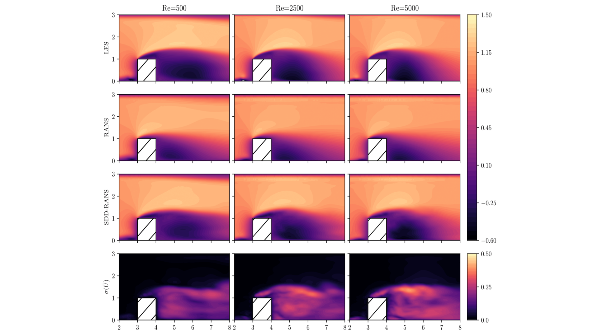

# Uncertainty Quantification of RANS Data-Driven Turbulence Modeling

[Quantifying model form uncertainty in Reynolds-averaged turbulence models with Bayesian deep neural networks](https://www.sciencedirect.com/science/article/pii/S0021999119300464)

[Nicholas Geneva](http://nicholasgeneva.com/), [Nicholas Zabaras](https://www.zabaras.com)

> A novel data-driven framework that not only improves RANS predictions but also provides probabilistic bounds for fluid quantities such as velocity and pressure. The uncertainties capture include both model form uncertainty as well as epistemic uncertainty induced by the limited training data. An invariant Bayesian deep neural network is used  to predict the anisotropic tensor component  of the Reynolds stress. This model is trained using  Stein variational gradient decent algorithm. The computed uncertainty on the Reynolds stress is propagated to  the quantities of interest by vanilla Monte Carlo simulation.

## Contents
Browse each of the folders for more information:

* `invar-nn` - Invariant neural network used for mapping between Reynolds-Averaged Navier-Stokes flow quantities to higher-fidelity turbulence quantities coded in Python 3 using PyTorch.
* `meshes` -  A library of meshes that were created for OpenFOAM using GMSH that can be used for training flows.
* `sdd-rans` - Reference for incoorporating deep learning into OpenFOAM and additional information on the CFD implementation.
* `training-data` - Provided training data for flows used in the original publication as well as pre-processing scripts.


> A schematic of the data-driven Bayesian machine learning model. The top block illustrates the model training using a set of different flows. Once trained, the model is then queried given a baseline RANS flow and a set of Reynolds stress (R-S) field realizations are sampled. Independent RANS simulations are then performed using these predicted fields by stochastic data-driven RANS (SDD-RANS) and statistics for quantities of interest (QoI) are collected.



> Normalized stream-wise mean velocity contours of a wall-mounted cube test flow for Reynolds numbers 500, 2500 and 5000 on the plane of symmetry. The top is the time averaged LES solution, below is the baseline RANS prediction followed by the SDD-RANS expected velocity. The fourth row shows the standard deviation field of the data-driven prediction

## Citation
Find this useful? Cite us with:
```latex
@article{geneva2019quantifying,
  title = "Quantifying model form uncertainty in Reynolds-averaged turbulence models with Bayesian deep neural networks",
  journal = "Journal of Computational Physics",
  volume = "383",
  pages = "125 - 147",
  year = "2019",
  issn = "0021-9991",
  doi = "https://doi.org/10.1016/j.jcp.2019.01.021",
  url = "http://www.sciencedirect.com/science/article/pii/S0021999119300464",
  author = "Nicholas Geneva and Nicholas Zabaras"
}
```
